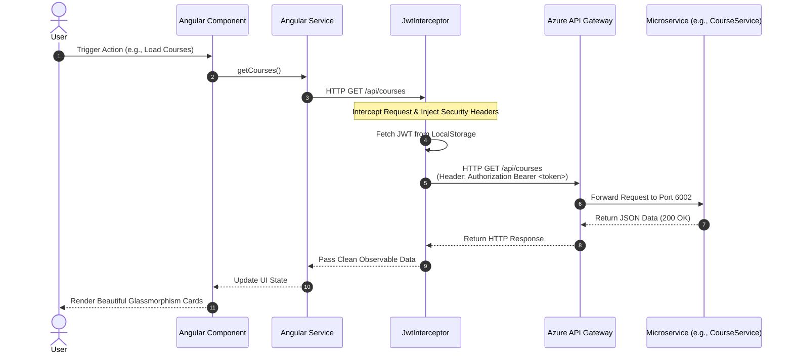

# 🎓 EduLearn Angular Standalone Frontend Architecture


---

## 📖 Executive Summary

**EduLearn Frontend** is a highly dynamic, responsive, and performant Single Page Application (SPA) built with **Angular 17/18 Standalone Components** and **TypeScript**. Designed with premium aesthetics, glassmorphism UI elements, and seamless micro-animations, the frontend provides an immersive learning experience for students and powerful curriculum management tools for instructors.

---

## 🖥️ Frontend Architecture & Component Hierarchy Diagram

The application strictly follows the **Core-Shared-Feature** modular architecture, leveraging Angular Standalone Components, functional Route Guards, HTTP Interceptors, and reactive state management via RxJS `BehaviorSubject`.

```mermaid
graph TD
    App[AppComponent<br/>Root Container] --> Core[Core Layer<br/>Services & Interceptors]
    App --> Shared[Shared Layer<br/>UI Components & Pipes]
    App --> Router[Angular Router<br/>Lazy Loaded Routes]

    subgraph Core Layer Services
        Core --> AuthSvc[AuthService<br/>User State / JWT]
        Core --> CourseSvc[CourseService<br/>Catalog API]
        Core --> ContentSvc[ContentService<br/>Curriculum API]
        Core --> ProgressSvc[ProgressService<br/>Tracking API]
        Core --> PaymentSvc[PaymentService<br/>Checkout API]
        Core --> Interceptor[JwtInterceptor<br/>Injects Bearer Token]
    end

    subgraph Feature Modules lazy loaded
        Router --> AuthMod[Auth Feature<br/>Login, Register, Forgot]
        Router --> StudentMod[Student Dashboard<br/>Enrolled Courses, Certs]
        Router --> InstructorMod[Instructor Dashboard<br/>Course Creation, Analytics]
        Router --> CourseMod[Course Catalog<br/>Details, Player, Checkout]
    end

    subgraph Shared UI Elements
        Shared --> Navbar[NavbarComponent<br/>Dynamic Role Links]
        Shared --> Footer[FooterComponent]
        Shared --> Modal[Google / Razorpay Modals]
    end
```



---

## 🎨 UI/UX Design System & Layout Flow Diagram

EduLearn prioritizes visual excellence with curated HSL color palettes, dark mode support, and smooth transitions. Below is the navigation and layout flow across different user personas.

```mermaid
graph LR
    Landing[Landing / Home Page] -->|Click Explore| Catalog[Course Catalog Page]
    Catalog -->|Select Course| Details[Course Details Page]
    
    Landing -->|Click Login| Login[Login / Google OAuth]
    Login -->|Role: Student| StudDash[Student Dashboard]
    Login -->|Role: Instructor| InstDash[Instructor Dashboard]

    StudDash -->|Resume Course| Player[Interactive Course Player]
    Player -->|Complete 100%| Cert[Generate Certificate Modal]

    Details -->|Click Enroll / Pay| Checkout[Premium Checkout Modal<br/>Razorpay / Simulation]
    Checkout -->|Success| StudDash

    InstDash -->|Create Course| Studio[Course Studio / Section Builder]
    Studio -->|Publish| Catalog
```



---

## 📡 Backend API Communication & Interceptor Flow

All HTTP requests to the microservices backend pass through the Angular `JwtInterceptor` and `ErrorInterceptor`, ensuring secure communication, automatic token attachment, and seamless global error handling.



---

## 📁 Project Structure & Module Organization

```text
EduLearn.Frontend/
├── src/
│   ├── app/
│   │   ├── core/                  # Singleton Services, Interceptors, Guards
│   │   │   ├── guards/            # auth.guard.ts, role.guard.ts
│   │   │   ├── interceptors/      # jwt.interceptor.ts, error.interceptor.ts
│   │   │   └── services/          # auth.service.ts, course.service.ts, etc.
│   │   ├── features/              # Feature-rich Standalone Components
│   │   │   ├── auth/              # login.component.ts, register.component.ts
│   │   │   ├── courses/           # course-player.component.ts, checkout.component.ts
│   │   │   ├── dashboard/         # student-dashboard.ts, instructor-dashboard.ts
│   │   │   └── landing/           # landing-page.component.ts
│   │   ├── shared/                # Reusable UI Components, Pipes, Directives
│   │   │   ├── components/        # navbar.component.ts, footer.component.ts
│   │   │   └── pipes/             # duration.pipe.ts, filter.pipe.ts
│   │   ├── app.component.ts       # Root Component
│   │   ├── app.config.ts          # Application Config (Providers, Routing)
│   │   └── app.routes.ts          # Root Route Definitions
│   ├── assets/                    # Images, Icons, Static Assets
│   ├── environments/              # environment.ts, environment.prod.ts
│   ├── index.html                 # Main HTML Entry Point
│   ├── main.ts                    # Angular Bootstrap Entry Point
│   └── styles.css                 # Global CSS Tokens & Tailwind Utilities
├── angular.json                   # Angular Workspace Configuration
├── package.json                   # NPM Dependencies & Scripts
├── staticwebapp.config.json       # Azure Static Web Apps Routing Configuration
├── tailwind.config.js             # Tailwind CSS Design System Tokens
└── tsconfig.json                  # TypeScript Compiler Configuration
```

---

## 🚀 Local Development Setup

### Prerequisites
- **Node.js** (v18.x or v20.x)
- **NPM** (v9.x or v10.x)
- **Angular CLI** (`npm install -g @angular/cli`)

### Step 1: Clone & Install Dependencies
```bash
git clone https://github.com/your-org/EduLearn-Frontend.git
cd EduLearn-Frontend
npm install
```

### Step 2: Configure Environment
Ensure `src/environments/environment.ts` points to your local API Gateway or backend services:
```typescript
export const environment = {
  production: false,
  apiUrl: 'http://localhost:5000/api' // Local API Gateway URL
};
```

### Step 3: Run Development Server
```bash
npm run dev
# or
ng serve
```
Open your browser and navigate to `http://localhost:4200/`. The application will automatically reload if you change any of the source files.

---

## ☁️ Azure Static Web Apps Production Deployment

The EduLearn Frontend is fully configured for automated CI/CD deployment to **Azure Static Web Apps (ASWA)**.

### Production Routing Configuration (`staticwebapp.config.json`)
To ensure deep linking and page refreshes work flawlessly without throwing `404 Not Found` errors on Azure CDN, the project includes `staticwebapp.config.json`:
```json
{
  "navigationFallback": {
    "rewrite": "/index.html",
    "exclude": ["*.{css,scss,js,png,gif,ico,jpg,svg,webp,woff,woff2,ttf}"]
  }
}
```

### GitHub Actions CI/CD Workflow
Upon pushing changes to the `dev` or `main` branch, the GitHub Actions workflow (`.github/workflows/azure-static-web-apps.yml`) automatically:
1. Installs NPM dependencies.
2. Builds the Angular production bundle using `ng build --configuration production`.
3. Deploys the static artifacts (`dist/edu-learn.frontend/browser`) to Azure's global edge CDN network.
